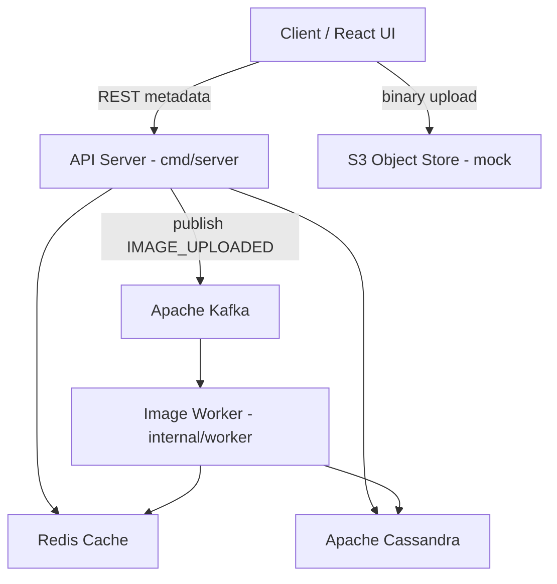

# Image Analysis Platform Lite — Architecture & API Reference

Repository: [github.com/droskat/BH-Backend](https://github.com/droskat/BH-Backend)

A high-performance Go + Gin REST API for image metadata management, built for 1M DAU with P99 < 100ms latency.

---

## Table of Contents

1. [Architecture Overview](#1-architecture-overview)
2. [Component Descriptions](#2-component-descriptions)
3. [Interaction Flows](#3-interaction-flows)
4. [API Reference](#4-api-reference)
5. [Environment Variables](#5-environment-variables)
6. [Verification](#6-verification)

---

## 1. Architecture Overview



> **Deployment note:** The worker currently runs inside the API process (`cmd/server/main.go`). The intended design (see `archDiagram.txt`) splits it into a standalone `cmd/worker` service. The interaction model below reflects the logical architecture.

### Project layout

```
cmd/server/          → HTTP entry point, router setup, graceful shutdown
cmd/worker/          → (planned) standalone Kafka consumer service
config/              → Environment-driven configuration
controllers/         → HTTP handlers with input validation
middlewares/         → JWT auth engine, rate limiting, panic recovery
models/              → Domain models, DTOs, Kafka events
services/            → Business logic, repository interfaces, cache layer
connectors/          → Cassandra, Redis, Kafka client initialization
internal/worker/     → Kafka consumer for background image processing
migrations/          → CQL schema scripts
scripts/             → Dev startup and API curl samples
```

### Technology stack

| Layer | Technology |
|-------|-----------|
| API Runtime | Go 1.22+ / Gin |
| Primary DB | Apache Cassandra (gocql) |
| Cache | Redis (go-redis/v9) |
| Message Broker | Apache Kafka (kafka-go) |
| Auth | Dual-token JWT (golang-jwt/v5) |

---

## 2. Component Descriptions

### Application layer

| Component | Location | Description |
|-----------|----------|-------------|
| **API Server** | `cmd/server/` | Go + Gin HTTP entry point. Handles auth, validation, routing, and synchronous CRUD. Publishes async events to Kafka on bulk upload. |
| **Router** | `cmd/server/router.go` | Registers routes, applies global middleware (logging, recovery, rate limiting), and JWT protection on `/api/v1/*` image routes. |
| **Controllers** | `controllers/` | Thin HTTP handlers. Parse and validate requests, call services, map errors to HTTP status codes. |
| **Services** | `services/` | Business logic. Orchestrates Cassandra repo, Redis cache, and Kafka publisher. Enforces BOLA (users can only access their own images). |
| **Image Worker** | `internal/worker/` | Kafka consumer loop. Simulates image analysis, writes metadata to Cassandra, invalidates Redis cache when processing completes. |
| **Config** | `config/` | Environment-driven settings for server port, Cassandra, Redis, Kafka, and JWT secrets/expiry. |
| **Models** | `models/` | Domain types, request/response DTOs, and Kafka event schemas. |

### Connectors

| Component | Location | Description |
|-----------|----------|-------------|
| **Cassandra connector** | `connectors/cassandra.go` | Creates gocql session with LocalQuorum consistency, retries, and token-aware routing. |
| **Redis connector** | `connectors/redis.go` | Creates go-redis client with connection pool; pings on startup. |
| **Kafka connector** | `connectors/kafka.go` | Creates Kafka writer (RequiredAcks=All) and reader for the `image-events` topic. |

### Middleware

| Middleware | Location | Description |
|------------|----------|-------------|
| **JWT Auth** | `middlewares/auth.go` | Validates Bearer access tokens; injects `user_id` into request context. Issues dual-token pairs (access + refresh). Default access TTL: 15 min. Default refresh TTL: 168 h. |
| **Rate Limiter** | `middlewares/ratelimit.go` | Global token bucket (~10k RPS, burst 10k). Returns 429 when exceeded. Applies to all routes including `/health`. |
| **Recovery** | `middlewares/recovery.go` | Catches panics and returns 500 instead of crashing the server. |

### Data stores

| Store | Schema / Keys | Role |
|-------|---------------|------|
| **Cassandra** | `images_by_id`, `images_by_user` | Source of truth for image metadata. Optimized for lookup-by-id and list-by-user (newest first). |
| **Redis** | `img:{image_id}`, `user_imgs:{user_id}` | Cache-aside layer. Speeds up reads; invalidated on bulk upload, worker completion, update, and delete. TTL: 48h + 1–6h jitter on repopulation. |
| **Kafka** | Topic: `image-events` | Async buffer between API (producer) and worker (consumer). Decouples upload acceptance from background processing. |
| **S3** (mock) | Presigned URLs | Binary storage referenced by upload/download URLs; mocked in this codebase. |

### Key design decisions

- **Cache-aside with jitter** — Prevents thundering herd via randomized TTL (48h + 1–6h jitter).
- **BOLA protection** — JWT `user_id` verified against resource ownership on every access.
- **Redis pipeline** — Atomic batch operations for cache invalidation during bulk uploads.
- **Kafka idempotent writes** — RequiredAcks=All ensures durable publish semantics.
- **Non-logged Cassandra batches** — Independent concurrent writes avoid coordinator overhead.
- **Graceful degradation** — Redis failures fall through to Cassandra transparently.

---

## 3. Interaction Flows

### Bulk upload (write path)

1. Client sends `POST /api/v1/images/bulk` with JWT.
2. API validates batch (max 50 items), generates UUIDs and mock S3 upload URLs.
3. API publishes `IMAGE_UPLOADED` events to Kafka.
4. API sets `PENDING` state in Redis and clears the user's list cache.
5. API returns **202 Accepted** immediately with upload URLs.
6. Worker consumes Kafka events, inserts rows into Cassandra, simulates analysis, updates status to `COMPLETED`, and clears stale Redis keys.

### Get image by ID (read path)

1. Client sends `GET /api/v1/images/:id` with JWT.
2. Service checks Redis (`img:{id}`).
3. On cache hit → renew TTL (48h) and return.
4. On cache miss → query Cassandra `images_by_id`, verify `user_id` matches JWT (BOLA), repopulate cache with TTL + jitter, return.

### List user images

1. Client sends `GET /api/v1/images` with JWT.
2. Service checks Redis (`user_imgs:{user_id}`).
3. On miss → query Cassandra `images_by_user` partition, cache result, return.

### Update / delete

1. Client sends `PUT` or `DELETE` on `/api/v1/images/:id` with JWT.
2. Service verifies ownership via Cassandra lookup (BOLA).
3. Mutates Cassandra, then asynchronously evicts `img:{id}` and `user_imgs:{user_id}` from Redis.

---

## 4. API Reference

**Base URL:** `http://127.0.0.1:8080` (default, configurable via `SERVER_PORT`)

**Content-Type:** `application/json` for all request/response bodies.

### Error format

```json
{
  "error": "description",
  "details": "optional validation or token detail"
}
```

### Global middleware responses

| Condition | Status | Response |
|-----------|--------|----------|
| Missing/invalid JWT on protected routes | 401 | `{ "error": "..." }` |
| Rate limit exceeded | 429 | `{ "error": "rate limit exceeded" }` |
| Resource owned by another user | 403 | `{ "error": "access denied" }` |
| Resource not found | 404 | `{ "error": "resource not found" }` |
| Validation failure | 400 | `{ "error": "validation failed", "details": "..." }` |

---

### Health

#### `GET /health`

No authentication required.

**Response `200 OK`**

```json
{ "status": "ok" }
```

---

### Authentication

#### `POST /api/v1/auth/login`

Issue an access + refresh token pair for a user.

**Request body**

| Field | Type | Required | Description |
|-------|------|----------|-------------|
| `user_id` | UUID string | Yes | User identity |

**Example**

```json
{ "user_id": "4a2bc1d8-7e3f-412e-a19b-625d91c84f32" }
```

**Response `200 OK`**

```json
{
  "access_token": "<JWT>",
  "refresh_token": "<JWT>",
  "expires_in": 900
}
```

| Field | Description |
|-------|-------------|
| `access_token` | Short-lived JWT (default 15 min). Use on protected routes. |
| `refresh_token` | Long-lived JWT (default 168 h). Use to obtain a new token pair. |
| `expires_in` | Access token lifetime in seconds |

**Errors:** `400` validation failed · `500` token generation failure

---

#### `POST /api/v1/auth/refresh`

Exchange a valid refresh token for a new token pair.

**Request body**

| Field | Type | Required |
|-------|------|----------|
| `refresh_token` | string | Yes |

**Response `200 OK`** — same shape as login

**Errors:** `400` validation failed · `401` invalid/expired refresh token · `500` generation failure

---

### Protected routes

All endpoints below require:

```
Authorization: Bearer <access_token>
```

---

#### `POST /api/v1/images/bulk`

Allocate image metadata and mock S3 upload URLs. Processing is async via Kafka.

**Request body**

| Field | Type | Required | Constraints |
|-------|------|----------|-------------|
| `images` | array | Yes | 1–50 items |
| `images[].original_filename` | string | Yes | 1–255 chars |
| `images[].file_type` | string | Yes | `image/png`, `image/jpeg`, `image/gif`, `image/webp`, `image/bmp`, `image/tiff` |

**Example**

```json
{
  "images": [
    { "original_filename": "landscape.png", "file_type": "image/png" },
    { "original_filename": "portrait.jpg", "file_type": "image/jpeg" }
  ]
}
```

**Response `202 Accepted`**

```json
{
  "status": "Allocation established. Complete S3 binary uploads.",
  "records": [
    {
      "image_id": "8fa97645-b461-45bc-89e4-c5d98a287bf1",
      "upload_url": "https://s3.amazonaws.com/bucket/8fa97645-...?X-Amz-Signature=...",
      "metadata": {
        "image_id": "8fa97645-b461-45bc-89e4-c5d98a287bf1",
        "status": "PENDING"
      }
    }
  ]
}
```

**Errors:** `400` validation / batch > 50 · `401` unauthorized · `500` publish failure

---

#### `GET /api/v1/images`

List all images for the authenticated user, newest first.

**Response `200 OK`**

```json
[
  {
    "image_id": "8fa97645-b461-45bc-89e4-c5d98a287bf1",
    "original_filename": "landscape.png",
    "upload_date": "2026-05-21T14:40:00Z",
    "status": "COMPLETED",
    "thumbnail_url": "https://cdn.platform.com/thumbnails/8fa97645-..."
  }
]
```

**Status values:** `PENDING` · `COMPLETED` · `FAILED`

**Errors:** `401` unauthorized · `500` retrieval failure

---

#### `GET /api/v1/images/:id`

Get full metadata for a single image.

**Path params:** `id` — UUID

**Response `200 OK`**

```json
{
  "image_id": "8fa97645-b461-45bc-89e4-c5d98a287bf1",
  "user_id": "4a2bc1d8-7e3f-412e-a19b-625d91c84f32",
  "original_filename": "landscape.png",
  "upload_date": "2026-05-21T14:40:00Z",
  "width": 1920,
  "height": 1080,
  "file_size": 204857,
  "file_type": "image/png",
  "status": "COMPLETED"
}
```

**Errors:** `400` invalid UUID · `401` unauthorized · `403` access denied · `404` not found · `500` internal error

---

#### `GET /api/v1/images/:id/download`

Generate a short-lived mock presigned download URL.

**Path params:** `id` — UUID

**Response `200 OK`**

```json
{
  "image_id": "8fa97645-b461-45bc-89e4-c5d98a287bf1",
  "download_url": "https://s3.amazonaws.com/bucket/private/8fa97645-...?X-Amz-Expires=300&Signature=..."
}
```

**Errors:** `400` invalid UUID · `401` unauthorized · `403` access denied · `404` not found · `500` internal error

---

#### `PUT /api/v1/images/:id`

Update modifiable metadata (filename only).

**Path params:** `id` — UUID

**Request body**

| Field | Type | Required | Constraints |
|-------|------|----------|-------------|
| `original_filename` | string | Yes | 1–255 chars |

**Example**

```json
{ "original_filename": "updated_v2_landscape.png" }
```

**Response `200 OK`**

```json
{ "status": "updated" }
```

**Errors:** `400` validation / invalid UUID · `401` unauthorized · `403` access denied · `404` not found · `500` internal error

---

#### `DELETE /api/v1/images/:id`

Delete an image and its metadata.

**Path params:** `id` — UUID

**Response `204 No Content`** — empty body

**Errors:** `400` invalid UUID · `401` unauthorized · `403` access denied · `404` not found · `500` internal error

---

### Endpoint summary

| Method | Path | Auth | Description |
|--------|------|------|-------------|
| GET | `/health` | No | Health check |
| POST | `/api/v1/auth/login` | No | Generate token pair |
| POST | `/api/v1/auth/refresh` | No | Refresh access token |
| POST | `/api/v1/images/bulk` | Yes | Bulk metadata upload (max 50) |
| GET | `/api/v1/images` | Yes | List user's images |
| GET | `/api/v1/images/:id` | Yes | Get image details |
| GET | `/api/v1/images/:id/download` | Yes | Generate presigned download URL |
| PUT | `/api/v1/images/:id` | Yes | Update image metadata |
| DELETE | `/api/v1/images/:id` | Yes | Delete image |

---

## 5. Environment Variables

| Variable | Default | Description |
|----------|---------|-------------|
| `SERVER_PORT` | `8080` | HTTP listen port |
| `CASSANDRA_HOSTS` | `127.0.0.1` | Comma-separated Cassandra hosts |
| `CASSANDRA_KEYSPACE` | `image_platform` | Keyspace name |
| `REDIS_ADDR` | `127.0.0.1:6379` | Redis address |
| `REDIS_PASSWORD` | `` | Redis password |
| `REDIS_DB` | `0` | Redis DB index |
| `KAFKA_BROKERS` | `127.0.0.1:9092` | Comma-separated Kafka brokers |
| `KAFKA_TOPIC` | `image-events` | Kafka topic name |
| `JWT_ACCESS_SECRET` | `access-secret-change-me` | Access token signing key |
| `JWT_REFRESH_SECRET` | `refresh-secret-change-me` | Refresh token signing key |
| `JWT_ACCESS_EXPIRY_MIN` | `15` | Access token TTL (minutes) |
| `JWT_REFRESH_EXPIRY_HOURS` | `168` | Refresh token TTL (hours) |
| `JWT_ISSUER` | `image-platform` | JWT issuer claim |

---

## 6. Verification

Runnable curl samples:

- `scripts/api-curl-samples.sh` — full flow or single endpoint
- `scripts/api-curl-samples.md` — copy-paste snippets

**Full happy-path flow:**

```bash
chmod +x scripts/api-curl-samples.sh
./scripts/api-curl-samples.sh
```

**Quick manual login:**

```bash
export BASE_URL=http://127.0.0.1:8080
export USER_ID=4a2bc1d8-7e3f-412e-a19b-625d91c84f32

curl -sS -X POST "${BASE_URL}/api/v1/auth/login" \
  -H "Content-Type: application/json" \
  -d "{\"user_id\":\"${USER_ID}\"}"
```

Use the `access_token` from the response as `Authorization: Bearer <token>` on image endpoints.

**Run tests:**

```bash
go test ./... -v
```
